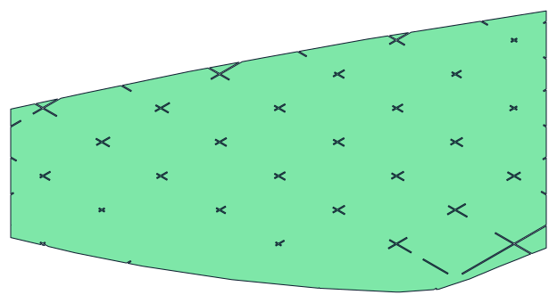

# ContinuousPath

Bake a lightweight internal structure **into the model geometry**, so the
slicer never has to generate one.

The tool cuts a grid of thin ribs into a solid (a wing, a fin, any
printable part) and writes an STL whose walls already contain that
structure. The slicer then prints it with plain perimeters — no infill,
no internal travel moves.

---

## Why do this at all

The target material is **lightweight PLA (LW-PLA)**, which foams and
expands as it extrudes. That has one awkward consequence: it cannot be
retracted cleanly. Any travel move risks stringing, and normal infill is
nothing *but* travel moves.

The way out is to print as close to **vase mode** as possible — one
continuous extrusion path, no retractions. But a pure vase-mode part is a
hollow shell with no internal strength.

So instead of asking the slicer for infill, the structure is cut into the
solid itself. Where the model has a slit, the slicer's perimeter simply
follows it inward and back out again. The extruder never lifts, and what
would have been a plain outer wall becomes a wall *plus* an internal rib.

## How it works

**1. Slit the solid.** Take a thin slab and subtract it from the model,
running the full height of the part. Printed along Z, the perimeter now
detours down that slit and back — an internal wall, drawn as part of the
outer wall.

**2. Run the slits all the way through.** A slit reaching only to the
centre adds little strength, so the slabs cross the whole section. But a
slab that cuts all the way through separates the part into pieces that
cannot be printed without retraction.

**3. Bridges reconnect it.** Small bridges are subtracted back out of the
slab, so the part stays in one piece and the nozzle keeps a continuous
path across the join.

**4. Holes lighten the ribs.** Further regions are subtracted from the
slab so the internal structure is not solid material.

In boolean terms:

```
cut_tool   = rib_slabs − bridges − holes
final_part = solid − cut_tool
```

Bridges and holes are removed *from the cutting tool*, so they are the
places where material is **kept**. That inversion is the single most
confusing thing about reading this code, and it is why `hole_solid`
describes solid material rather than a void.

Because only thin slabs are removed, the part loses very little mass —
typically **well under 1%**. The structure is the *slit pattern*, not a
hollowed interior.

## Installing

The geometry core needs only standard Python packages:

```bash
python -m pip install -r requirements.txt
```

The pipeline itself drives **FreeCAD 1.1**, which is not pip-installable.
Run it with FreeCAD's own bundled interpreter:

```powershell
& 'C:\Program Files\FreeCAD 1.1\bin\python.exe' main.py --preset wingR1
```

`manifold3d` is required, not optional — the booleans default to
`engine='manifold'`.

## Try it

A small example wing is included and runs straight from a fresh clone —
about 10 seconds, no model of your own required:

```powershell
& 'C:\Program Files\FreeCAD 1.1\bin\python.exe' main.py --preset example
python examples/make_preview.py     # writes a planform section as SVG
```



The outline is the wing; every internal boundary is a rib or a lightening
hole. See `examples/README.md` for what the numbers should look like —
and for why an *airfoil* section still shows a single closed loop.

## Running it

Parameters live in `config.toml` as a `[defaults]` block plus named
presets:

```powershell
python main.py --list-presets
python main.py --preset fin
python main.py --config config.local.toml --preset wingR1
python main.py --preset wingR1 --model-dir D:/models
```

Paths in the config are relative and resolve against `model_dir`, or the
config file's own directory. Keep machine-specific paths in
`config.local.toml`, which is gitignored.

### Parameters worth understanding

| key | meaning |
|---|---|
| `construction_plane` | `XY`/`XZ`/`YZ` — the plane the rib grid is drawn in |
| `primary_dir` | slicing axis **and** the grid's in-plane reference direction |
| `thickness` | rib wall thickness (the slit width) |
| `bridge_height` | bridge width; clamped down where the section is thinner |
| `hole_margin` | clearance around holes; effective margin is `hole_margin + thickness/2` |
| `z_step` | slice spacing **along `primary_dir`** |

Three constraints are easy to violate and produce confusing results:

- **`primary_dir` must lie *in* `construction_plane`, never along its
  normal.** It doubles as the grid's reference direction, and the grid
  builder takes `cross(plane_normal, primary_dir)` — degenerate when they
  are parallel. Slicing along Y therefore needs `XY` or `YZ`, never `XZ`.
  This is checked at startup.
- **Avoid `grid_orientation ± rib_angle` landing on 90°.** That makes the
  rib plane perpendicular to `primary_dir`, and the entire rib family is
  silently dropped.
- **`z_step` steps along `primary_dir`.** Changing that axis can change
  the slice count by an order of magnitude, and with it the runtime.

## Input requirements

The input **must be a closed, single-shell solid with positive volume.**

`Part.Shape.isValid()` does *not* test this — it validates individual
faces, so a mesh-derived solid can report `valid=True` while being
unusable. FreeCAD's Check Geometry will happily pass such a shape.

Booleans against an unclosed input do not raise. They either return a
Null shape or run for hours in OCC's non-solid path, and the exported STL
comes out looking like an ordinary solid part with no structure at all.
`main.py` therefore reports `closed` / `shells` / `volume` before doing
any work, and says plainly when the input cannot be cut.

If your model fails that check, repair it as a **mesh** (Meshmixer,
Fusion, netfabb) and re-import. Capping an open wing tip is a modelling
decision, not something this tool should invent.

## Performance note

These wings are mesh-derived solids — one planar BREP face per triangle,
often 150k+ faces. OCC pays full triangle-soup cost on such input with
none of the benefit of exact surface algebra. Measured with an identical
6-face cutting box: **3.4 s at 18k faces, 104.8 s at 167k**, scaling
roughly as `faces^1.5`.

So when the input mesh is watertight, the final cut is done entirely in
trimesh/manifold instead. On geometry that took hours through BREP, the
whole pipeline runs in about **100 seconds**. BREP remains as a fallback
for inputs that are not valid volumes.

## Layout

FreeCAD-free — importable and testable under any Python:

| module | role |
|---|---|
| `rib_slice_core.py` | slicing, edge clustering, bridge/hole width policies |
| `solidify_utils.py` | extruding flat strips into solids, boolean tree-union |
| `mesh_simplify_utils.py` | coplanar face merging, zero-volume sliver removal |

Requires FreeCAD:

| module | role |
|---|---|
| `main.py` | CLI, config loading, pipeline orchestration |
| `slab_utils.py` | document I/O, tessellation, rib grid and segmentation |
| `bridge_utils.py` / `hole_utils.py` | bridge and hole generation |
| `rib_solid_utils.py` | full rib slabs |
| `assembly_utils_freecad.py` | final assembly, mesh↔BREP conversion |
| `viz_utils.py` | writing preview objects into the document |

`bridge_utils`, `hole_utils` and `rib_solid_utils` are pure geometry in
substance; they import FreeCAD only for visualisation helpers.

## Tests

```bash
python -m pip install -r requirements-dev.txt
python -m pytest
```

51 tests, ~2 seconds, **no FreeCAD required**. They cover the geometry
core, where every bug is a few lines of arithmetic whose effects only
become visible after a multi-minute run. See `tests/README.md` for what
is deliberately *not* covered — the FreeCAD I/O layer, the BREP
conversion and the assembly booleans still need an end-to-end run.

## Printing the result

The output is an ordinary STL. Slice it with **no infill and no support**
— the structure is already in the geometry.


## Licence

MIT — see `LICENSE`. The licence covers this code only. Model files are
not included and remain under their own terms.
