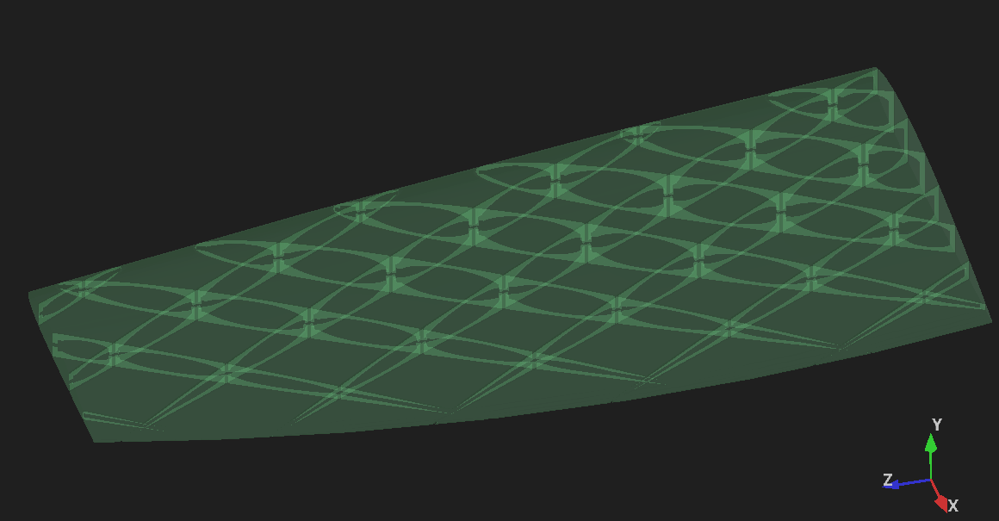

# Example

A small tapered, swept wing you can run the pipeline on straight from a
fresh clone.

```powershell
& 'C:\Program Files\FreeCAD 1.1\bin\python.exe' main.py --preset example
```

Roughly 10 seconds. It writes `example_wing_structured.stl` next to the
input.

## What you should see

```
Input 'ExampleWing': 65 faces, valid=True, closed=True, solids=1, shells=1,
                     volume=123588.8
Created 77 rib segments (analytical grid).
Bridge solid: 11328 faces, watertight=True
Hole solid:    9308 faces, watertight=True
  rib - bridges: 12348 faces, watertight=True
  rib - holes:   20852 faces, watertight=True
Final (trimesh): 38378 faces, watertight=True, volume=120722.2
  material removed by ribs: 1653.0 mm^3 (1.35% of the wing)
```

`watertight=True` at every stage is the thing to check. If the input
report says anything other than `closed=True` with one shell, stop —
see the README's *Input requirements*.

## Looking at the result



Open `example_wing_structured.stl` in a viewer, or load the FreeCAD
document. Two rib families cross at ±30°; the lens shapes are the
lightening holes, and the short bars at each crossing are the bridges.

**If you section it, pick the right plane or you will think nothing
happened.** The rib grid runs *through* the thickness, so:

| section plane | what it shows |
|---|---|
| planform (perpendicular to thickness) | the full grid |
| airfoil (perpendicular to span) | a single closed loop |

The airfoil section staying one loop is not a failure — it is the bridges
working. They deliberately keep the part in one piece so the nozzle never
has to retract. Only 1.35% of the material is gone; the structure is the
*slit pattern*, not a hollowed interior.

## Where the wing came from

`example_wing.FCStd` is generated, not hand-modelled or downloaded. It is
a loft through NACA 4-digit sections — root chord 100 mm, tip 55 mm,
200 mm span, 35 mm sweep, −3° washout — giving a closed 65-face solid of
123,589 mm³.

The airfoil comes from the published NACA formula, so the example is
original to this project and carries no third-party model licence. That
matters: this repository deliberately contains no downloaded geometry.

It is saved as `.FCStd` rather than STEP on purpose. STEP has no single
authoritative unit — FreeCAD's importer applies a per-machine preference,
and a round-trip of this wing came back scaled by 25.4, turning a 200 mm
span into 5 m and the run into a multi-thousand-slice crawl. An example
that silently depends on a local setting is worse than no example.

## A note on previews

The `example` preset turns the `vis_*` flags off, because the pipeline
writes its preview meshes into the input document and saves it. Leaving
them on inflates `example_wing.FCStd` and leaves it dirty in git.

To inspect the intermediate geometry (rib segments, bridges, holes) in
the FreeCAD GUI, turn the flags on in `config.toml`, run, then reset the
document afterwards:

```powershell
git checkout examples/example_wing.FCStd
```

Even with previews off, FreeCAD rewrites a timestamp on save, so the file
may show as modified by a few bytes after a run. That is harmless.
